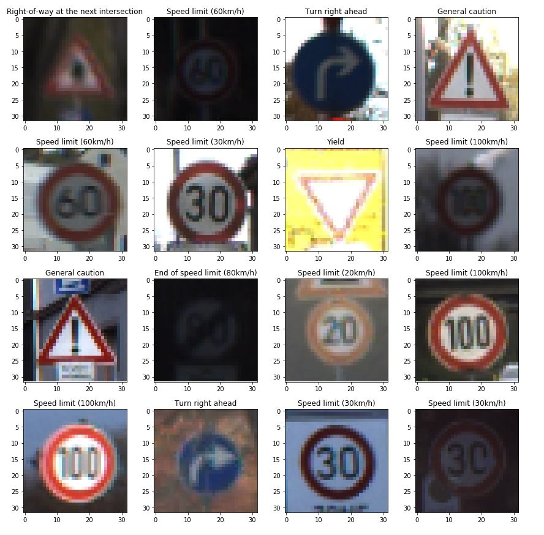
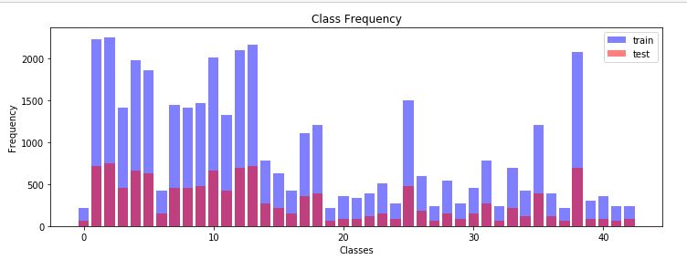
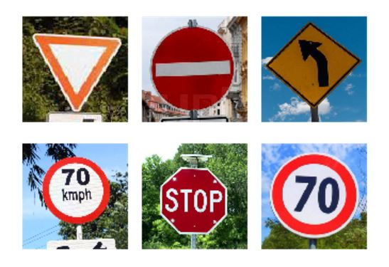
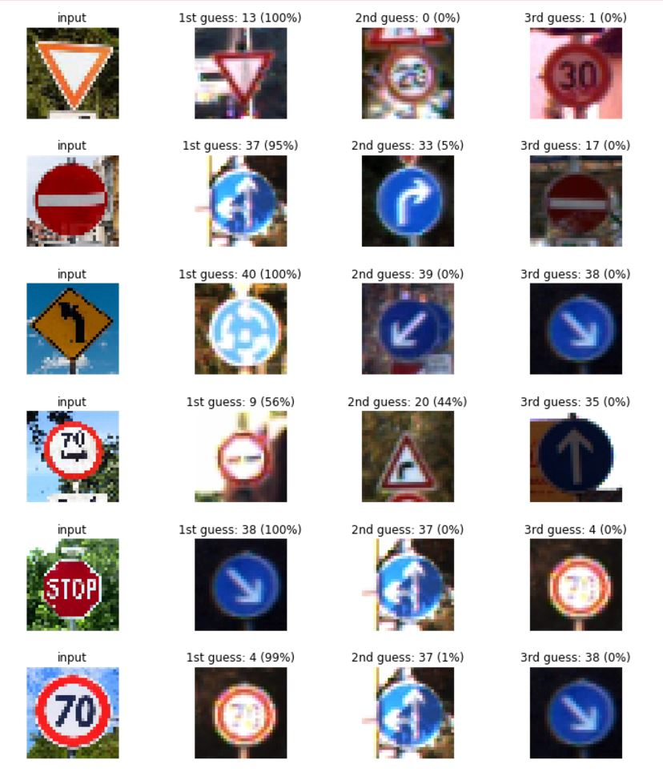

# Build a Traffic Sign Recognition Classifier
##### - by NK Zou

---

### Rubric Points

### 1- Files Submitted
#### Submission Files
  
* Traffic_Sign_Classifier.ipynb  
* Traffic_Sign_Classifier.html  
* train.p & test.p (download link on step 0 in Traffic_Sign_Classifier.ipynb )  
* 6 test images in images folder  
* lenet.meta, lenet.index, lenet.data  
* signnames.csv  
* writeup.md  
  
  
### 2- Dataset Exploration
#### 2.1- Dataset Summary (step 1.1 in Traffic_Sign_Classifier.ipynb )
#### The submission includes a basic summary of the data set.
  
* Number of training examples = 39209  
* Number of testing examples = 12630  
* Image data shape = (32, 32)  
* Number of classes = 43  
  
#### 2.2- Exploratory Visualization (step 1.2 in Traffic_Sign_Classifier.ipynb )
#### The submission includes an exploratory visualization on the dataset.  
  
  
  
  
  
### 3- Design and Test a Model Architecture
#### 3.1- Preprocessing (step 2.1 in Traffic_Sign_Classifier.ipynb )
#### The submission describes the preprocessing techniques used and why these techniques were chosen.
  
* Use OpenCV to normalize the data to the range (-1,1), make the mean of the result of the dataset unequal to zero, but it was reduced from around 82 to -0.35. Different features could encompass far different ranges and a single learning rate might make some weights diverge.  
* Obviously need to be shuffle and split data by sklearn, not need to explain too much, it will help to improve accuracy of the model.  
  
#### 3.2- Model Architecture (step 2.2 in Traffic_Sign_Classifier.ipynb )
#### The submission provides details of the characteristics and qualities of the architecture, such as the type of model used, the number of layers, the size of each layer. Visualizations emphasizing particular qualities of the architecture are encouraged.
  
  
Just like the image bove, I selected LeNet as train model.  
* Layer 1- Convolutional: Input = 32x32x1, Output = 28x28x6. Activation. Pooling: Input = 28x28x6, Output = 14x14x6.  
* Layer 2- Convolutional: Output = 10x10x16. Activation. Pooling: Input = 10x10x16, Output = 5x5x16. Flatten: Input = 5x5x16, Output = 400.  
* Layer 3- Fully connected: Input = 400, Output = 120. Activation. Dropout.  
* Layer 4- Fully connected: Input = 120, Output = 84. Activation. Dropout.  
* Layer 5- Fully Connected: Input = 84, Output = 43.  
  
#### 3.3- Model Training (step 2.3 in Traffic_Sign_Classifier.ipynb )
#### The submission describes how the model was trained by discussing what optimizer was used, batch size, number of epochs and values for hyperparameters.
* epochs = 100, batch size = 128, keep probability = 0.5, learning rate=0.001, ,decay steps=10000, decay rate=0.96.  
* AdamOptimizer because it is faster than SGD.  
* Validation Accuracy = 99.2%, Test Accuracy = 94.9%. Epochs between 50 to 100 will get best accuracy.  
* No L2 regulation since I have used drop out that is use to solve overfitting as well.  
* No batch normalization because I have used Relu, this activation is better then Sigmoid, it will not gradient vanishing or explosion.  
  
#### 3.4- Solution Design
#### The project thoroughly discusses the approach taken for deriving and designing a model architecture fit for solving the problem given.
  
* Just like I mentioned earlier, I started with LeNet to training data.  
* I got a bad accuracy, then I modify hyperparameter, such as epochs = 200, it falls into overfitting.  
* After tried different combined of parameters, test accuracy is reached to 94.9%.  
  
  
### 4- Test a Model on New Images
#### 4.1- Acquiring New Images (step 3.1 & 3.2 in Traffic_Sign_Classifier.ipynb )
#### The submission includes five new German Traffic signs found on the web, and the images are visualized. Discussion is made as to any particular qualities of the images or traffic signs in the images that may be of interest, such as whether they would be difficult for the model to classify.
  
  
* I think some images might be difficult to classify it since it does not particular stick out, such as the yellow sign.  
* But the result makes me surprise, stop sign can't be recognized but the predicting probability is 56% from a confused image.  
  
#### 4.2- Performance on New Images (step 3.3 in Traffic_Sign_Classifier.ipynb )
#### The submission documents the performance of the model when tested on the captured images. The performance on the new images is compared to the accuracy results of the test set.
  
  

  
Just like I mention earlier, the result really makes me surprised. Maybe I shall try to add gray function into the model next time.  
  
#### 4.3- Model Certainty - Softmax Probabilities (step 3.3 in Traffic_Sign_Classifier.ipynb )
#### The top five softmax probabilities of the predictions on the captured images are outputted. The submission discusses how certain or uncertain the model is of its predictions.
  
```  
TopKV2(values=array([[  1.00000000e+00,   0.00000000e+00,   0.00000000e+00,  
          0.00000000e+00,   0.00000000e+00],  
       [  9.51228142e-01,   4.87718731e-02,   9.46709169e-11,  
          2.67691442e-11,   8.25127722e-16],  
       [  9.97702301e-01,   2.01689731e-03,   2.63686059e-04,  
          1.67928647e-05,   3.79637783e-07],  
       [  5.64229786e-01,   4.35770184e-01,   7.34170200e-08,  
          1.65423728e-08,   2.04418120e-14],  
       [  1.00000000e+00,   1.44037028e-12,   2.08100692e-17,  
          1.73794726e-21,   4.49694671e-23],  
       [  9.91975486e-01,   7.97730871e-03,   4.71683015e-05,  
          3.94968991e-09,   1.27546862e-09]], dtype=float32), indices=array([[13,  0,  1,  2,  3],  
       [37, 33, 17, 39, 35],  
       [40, 39, 38, 37, 33],  
       [ 9, 20, 35, 41, 16],  
       [38, 37,  4, 26, 40],  
       [ 4, 37, 38, 26, 18]], dtype=int32))  
```  
This model is uncertain in some case, yield sign was 100% certain and speed limit (70km/h) also reached 99%, but I can't believe that stop sign is uncertainty, even no pass sign still keep 56% certain. Maybe I shall try to gray image in next time, I hope it will improve the accuracy.
